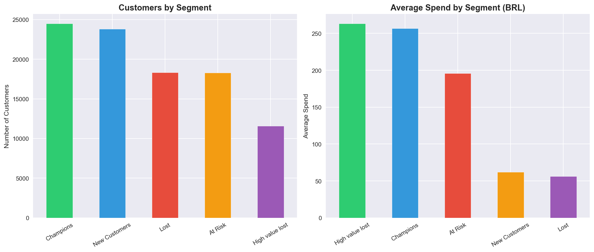
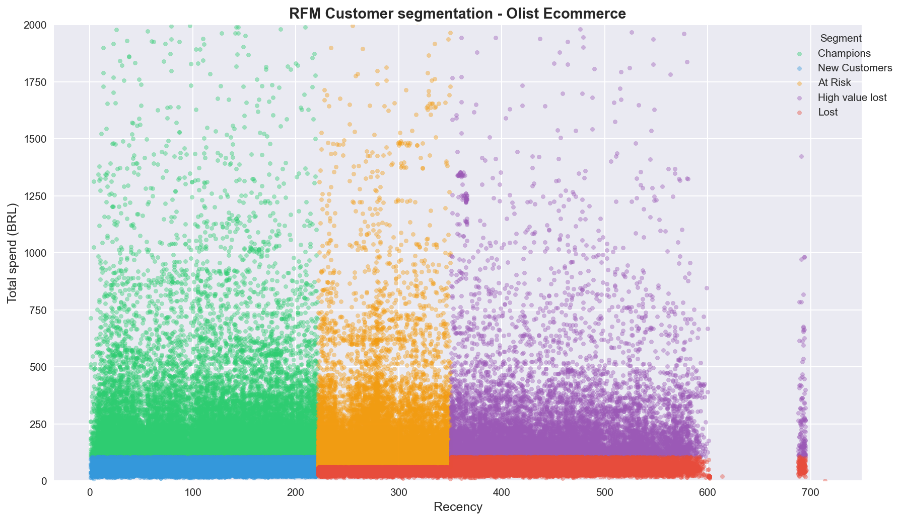

# Customer Segmentation with RFM - Olist Ecommerce

Understanding who your customers really are is the foundation of any retail strategy. 
This project applies RFM analysis to real ecommerce data to identify distinct customer 
segments and translate them into actionable business recommendations.

## The Data

[Olist Brazilian E-Commerce dataset](https://www.kaggle.com/datasets/olistbr/brazilian-ecommerce) 
— 99,441 orders placed between 2016 and 2018 across multiple product categories.

## Approach

RFM breaks down customer behavior into three questions:
- **Recency:** how many days ago did they last buy?
- **Frequency:** how many orders have they placed?
- **Monetary:** how much have they spent in total?

Each metric is scored 1–4 using quartiles. R and M scores are combined into a 
behavioral fingerprint ("44" = recent + high spend, "11" = inactive + low spend) 
that defines 5 business segments.

## Results

| Segment | Customers | % | Avg Spend (BRL) |
|---|---|---|---|
| Champions | 24,504 | 25.4% | ~260 |
| New Customers | 23,796 | 24.7% | ~65 |
| At Risk | 18,273 | 18.9% | ~195 |
| High-Value Lost | 11,587 | 12.0% | ~260 |
| Lost | 18,318 | 19.0% | ~55 |

**Key finding:** High-Value Lost customers spent as much as Champions on average 
but haven't purchased in over 400 days — the highest priority segment to recover.

**Notable insight:** Nearly all customers purchased only once, revealing a 
significant retention problem beyond segmentation.

## Visualizations

## Recommendations

| Segment | Action | Channel |
|---|---|---|
| Champions | Loyalty rewards, early access to deals | Personalized email |
| New Customers | Second-purchase coupons, onboarding | Push notification |
| At Risk | Reactivation campaign with discount | Email + retargeting |
| High-Value Lost | Exclusive high-value offer | Direct email |
| Lost | Exclude from paid campaigns | — |

## Stack
Python · pandas · scikit-learn · matplotlib · seaborn
